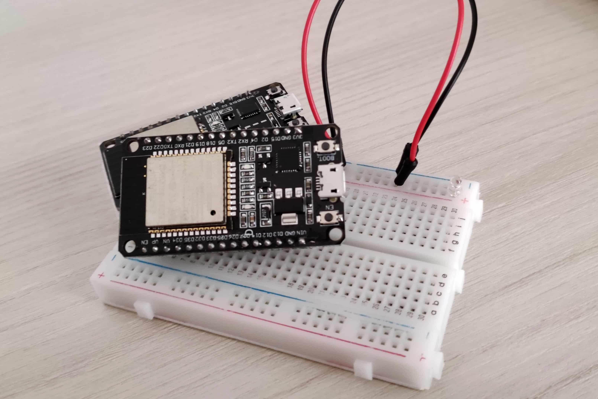

# ESP32 Alexa TV Remote
Voice-controlled ESP32 TV remote.

# Disclaimer
This is more like a prototype rather than a finished project: the code is pretty bad and the circuit should be improved.

# Circuit
The circuit is extremely simple (and should be improved). It consists of an IR LED connected to a pin on the board and grounded to the board's ground pin.

# Thanks to...
[Thierry T. (lepiaf)](https://github.com/lepiaf) for providing [Samsung TV IR control codes](https://github.com/lepiaf/IR-Remote-Code#ir-remote-code) (among many others).

# TODO
1. Clean up the code.
2. Improve the circuit (use a transistor to control the LED rather than directly attaching it to the ESP board).
3. Implement local MQTT communication to avoid using the [Sinric Pro](https://sinric.pro) API.
